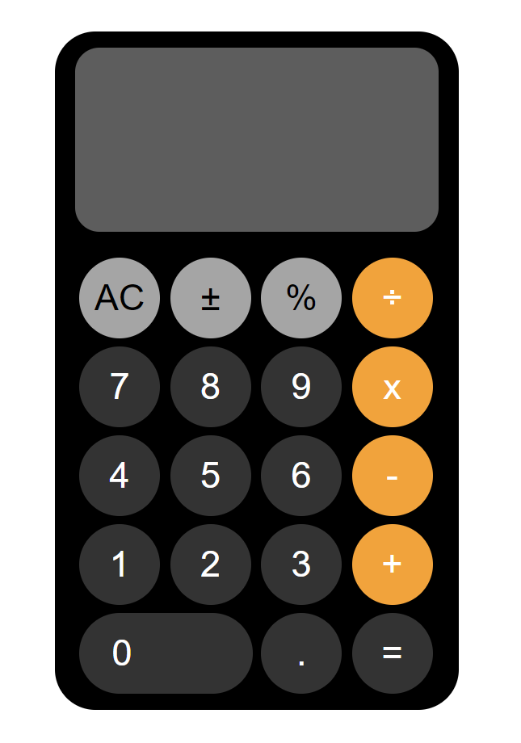

# ios-calculator

## Table of contents

- [Overview](#overview)
  - [The challenge](#the-challenge)
  - [Project Skeleton](#project-skeleton)
  - [Screenshot](#screenshot)
  - [Links](#links)
- [My process](#my-process)
  - [Built with](#built-with)


## Overview

### The challenge

Your company has recently started on a project that aims to create ios calculator. So you and your colleagues have started to work on the project.

### Project Skeleton

```
ios-calculator (folder)
        |----index.html 
        |----style.css                   
```
### Screenshot

<p align="center">
<a href="https://sezginakgul.github.io/ios-calculator/"></a>
</p>


### Links

- Live: [Live Website](https://sezginakgul.github.io/ios-calculator/)


### Built with

- Semantic HTML5 markup
- CSS custom properties
- Flexbox
- CSS Grid
- Mobile-first workflow
- Styled Components - For styles
- HTML Forms-Input Types
- HTML Form Elements
- CSS Colors-Border Properties
- CSS Margins-Padding
- CSS Properties for Texts-Font Families-Links
- CSS Overflow Property-The float Property-Opacity 
- Transparency-Units in CSS
- CSS Setting height and width-CSS Outline-CSS Combinators
